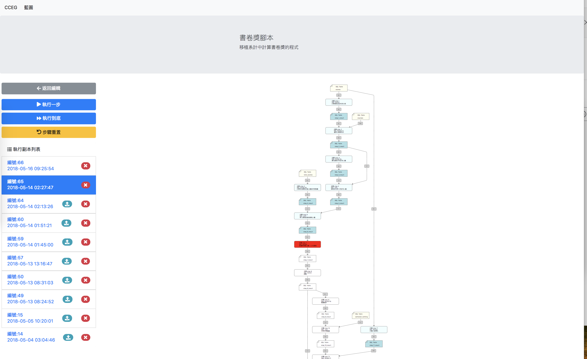

# CCEG 流程平台



本專案使用 PHP 7 撰寫

## 本地測試與開發

1. 請先於開發環境準備 docker 與 docker-compose
2. 執行 ./docker-composer-start.sh 腳本
3. 即可於 localhost:8080 開始測試
4. 因為此專案資料夾有透過 docker compose 掛入容器之中，所以修改檔案就可以直接看到變動，方便開發

## 部署注意事項

1. 需要滿足 Laravel 5.5 部署需求 https://laravel.com/docs/5.5#installation
2. 需要使用 MySQL, 因為有使用到跨資料庫的 SQL 語法。建議使用 MySQL 5.6 或 5.7, 最好是用 8.0 以上, 因為有 8.0 以上有支援 SQL Window Functions 在使用上會比較方便。
3. 本專案使用的 MySQL 帳號必須有 CREATE DATABASE 權限

## 程式結構

本專案使用 Laravel 框架，重要的幾個檔案如下：

檔名 | 用途
------------ | -------------
routes/web.php | 定義 HTTP endpoints
app/Http/Controllers/*.php | 處理 HTTP endpoints 的入口
app/StorageBuilder/*.php | 各種儲存空間的實作
app/StepRunner/*.php | 各種流程步驟的實作
app/Blieprint.php | 藍圖的 ORM Model
app/Runtime.php | 副本的 ORM Model
app/RuntimeStorage.php | 儲存的 ORM Model
app/Step.php | 步驟的 ORM Model
app/StepConnection.php | 連結的 ORM Model
resources/views/*.php | 由 controller 執行用來回給前端 html+js 的程式
resources/assets/*.js | 前端所需的靜態 js
z3 | SMT 流程步驟中所使用的 Microsoft Z3 Solver 執行檔

目前主要的開發工作都會是在 php 這端，包含擴充儲存空間與流程步驟

如果有需要做 UI 元件的變動就需要處理到 resources/assets/ 底下的檔案。

*特別注意* 若 resources/assets/ 有變動的話需要重新執行 `npm run dev` 或 `npm run prod` 重新組合壓縮這些 js 檔


## StorageBuilder/Builder 與 StepRunner/Runner 介面

這兩個介面定義了系統抽象化儲存空間與流程步驟，可以透過實作新的 StorageBuilder 與 StepRunner 來擴充系統的流程處理功能。

```php
interface Builder
{
    static function getName();
    static function build($runtime, $key, $name, $payload);
    static function getFormSchema();
    static function getFormUISchema();
}

interface Runner
{
    static function run($step);
    static function getBlueprintStepStorage($bluePrintStorages, $bluePrintStepPayload);
    static function supportedInputStorageType();
    static function getName();
    static function getFormSchema($bluePrintStorages);
    static function getFormUISchema();
}
```

實作的參考可以看 app/StorageBuilder 與 app/StepRunner 資料夾

